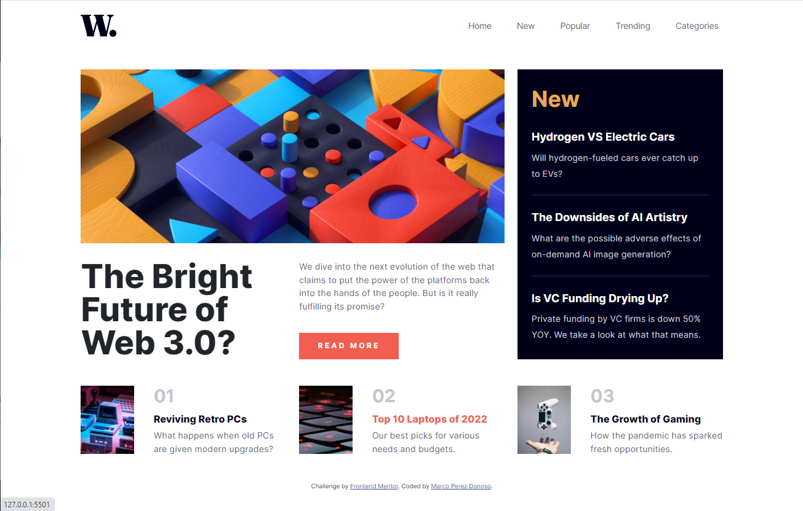

# Frontend Mentor - News homepage solution

This is a solution to the [News homepage challenge on Frontend Mentor](https://www.frontendmentor.io/challenges/news-homepage-H6SWTa1MFl). Frontend Mentor challenges help you improve your coding skills by building realistic projects. 

## Table of contents

- [Overview](#overview)
  - [The challenge](#the-challenge)
  - [Screenshot](#screenshot)
  - [Links](#links)
- [My process](#my-process)
  - [Built with](#built-with)
  - [What I learned](#what-i-learned)
  - [Continued development](#continued-development)
  - [Useful resources](#useful-resources)
- [Author](#author)

## Overview

### The challenge

Users should be able to:

- View the optimal layout for the interface depending on their device's screen size
- See hover and focus states for all interactive elements on the page
- **Bonus**: Toggle the mobile menu (requires some JavaScript)

### Screenshot



### Links

- Solution URL: [Add solution URL here](https://github.com/marcopdonoso/News-homepage-main)
- Live Site URL: [Add live site URL here](https://marcopdonoso.github.io/News-homepage-main/)

## My process

### Built with

- Semantic HTML5 markup
- CSS custom properties
- [Bootstrap 5.2](https://getbootstrap.com/)

### What I learned

I've learned to using Bootstrap offcanvas to transform expanding and collapsing navbar into an offcanvas drawer.

```html
<button class="navbar-toggler" type="button" data-bs-toggle="offcanvas" data-bs-target="#offcanvasNavbar" aria-controls="offcanvasNavbar" aria-expanded="false" aria-label="Toggle navigation">
          <span class="navbar-toggler-icon"></span>
        </button>

        <div class="offcanvas offcanvas-end" tabindex="-1" id="offcanvasNavbar" aria-labelledby="offcanvasNavbarLabel">
          <div class="offcanvas-header">
            <button type="button" class="btn-close ms-auto" data-bs-dismiss="offcanvas" aria-label="Close"></button>
          </div>
          <div class="offcanvas-body">
            <ul class="navbar-nav ms-auto">
              <li class="nav-item">
                <a href="" class="nav-link">Home</a>
              </li>
              <li class="nav-item">
                <a href="" class="nav-link">New</a>
              </li>
              <li class="nav-item">
                <a href="" class="nav-link">Popular</a>
              </li>
              <li class="nav-item">
                <a href="" class="nav-link">Trending</a>
              </li>
              <li class="nav-item">
                <a href="" class="nav-link">Categories</a>
              </li>
            </ul>
          </div>
        </div>
```

### Continued development

I'll continue studying the Bootstrap Library, because 
I think it's worth it as it saves a lot of time and has a lot of powerful tools. 

### Useful resources

- [Bootstrap 5.2 Documentation](https://getbootstrap.com/docs/5.2/getting-started/introduction/) - This helped me for use Bootstrap while learning the basics.

## Author

- Website - [Marco Perez Donoso](https://marcopdonoso.github.io)
- Frontend Mentor - [@marcopdonoso](https://www.frontendmentor.io/profile/marcopdonoso)
- Twitter - [@marcopdonoso](https://www.twitter.com/marcopdonoso)